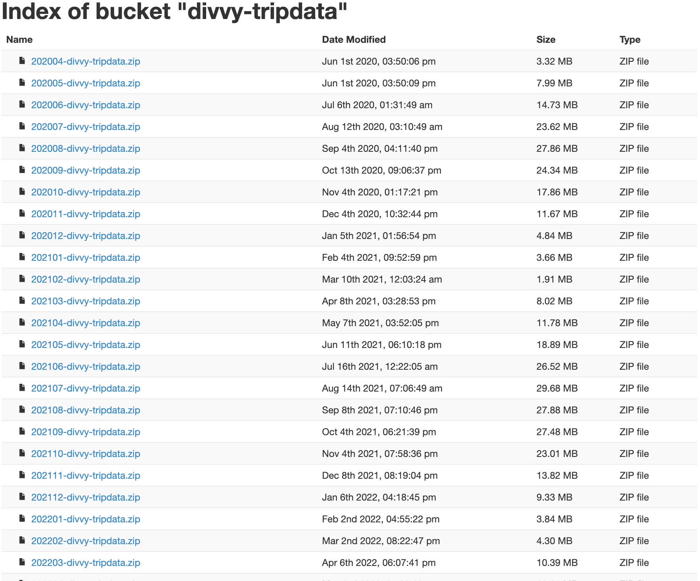

*Data analysis code and documentation for Cyclistic's bike share data is contained in this repository.
There are several phases to the project, from data analysis to data visualization to recommendations, and this README summarizes each phase.*

# Data Analytics Capstone Project: Cyclistic Bike Sharing Analysis
**Case Study: How Does a Bike-Share Navigate Speedy Success?**  
*by Vesna Marija Brekalo* 
*February, 23 2024*

## :white_large_square: FOREWORD
I completed a case study on **Cyclistic** bike-share for my Google Data Analytics certification, inspired by my passion for cycling. This project, my first in analytics, explores the differences between casual and member riders following Google's framework: **Ask**, **Prepare**, **Process**, **Analyze**, **Share**, **Act**. Check out [my data visualizations here](https://www.linkedin.com/in/vesna-marija-brekalo).

> **Table of Contents:**
> * **INTRODUCTION**
>   * Project Overview and Context 
> * **ASK**
>   * Business Goals and Objectives 
>   * Defining the Analytical Task 
>   * Identifying Key Stakeholders 
> * **PREPARE**
>   * Data Sourcing and Initial Exploration 
> * **PROCESS**
>   * Data Cleaning and Preprocessin 
> * **ANALYZE & SHARE**
>   * Ride Volume Analysis 
>   * Average Ride Duration Insights 
>   * Bike Type Preferences 
>   * Temporal Usage Patterns 
>   * Station Popularity Metrics 
> * **ACT**
>   * Strategic Recommendations for Action

## :white_large_square: INTRODUCTION
**Cyclistic**, founded in 2016, operates a vast fleet of over 16,500 bicycles covering 190 square miles in Chicago. The bikes, strategically located across 800 stations in the city, cater to urban riders with diverse heights and abilities, boasting a design focused on comfort and stability. Users can unlock bikes at any station and return them to any other station at their convenience.

Initially, Cyclistic's marketing aimed at raising general awareness and appealing to a diverse audience with various pricing plans: single-ride passes, full-day passes, and annual memberships. Casual riders are those opting for short-term passes, whereas annual memberships are purchased by Cyclistic members.

Financial analysis indicates annual members generate more profit than casual riders. To capitalize on this, Moreno, Cyclistic's director of marketing, prioritizes converting casual riders into members rather than attracting new customers. The strategy revolves around understanding the differences between these groups, why casual riders might switch to memberships, and the role of digital media in marketing.

Maximizing annual memberships is key to Cyclistic's future success, prompting Moreno's team to analyze historical trip data to uncover trends. As their recommendations necessitate executive approval, they must provide compelling data insights and professional visualizations.

## :white_large_square: ASK
**Business Objective:** 
Develop effective marketing strategies to convert casual riders into annual members.  

To **achieve** this **objective**, the future marketing program will address the following three pivotal **questions**:
> 1. How do annual members and casual riders use Cyclistic bikes differently?
> 2. Why would casual riders buy Cyclistic annual memberships?
> 3. How can Cyclistic leverage digital media to encourage casual riders to transition into annual members?

**Key Stakeholders:**
- Lily Moreno: Director of the marketing team and my supervisor.
- Cyclistic executive team.

## :white_large_square: PREPARE
#### Data Collection and Sources:

For this case study, we utilize data from Divvy, a real bike share company operating in Chicago, as a proxy for the fictional company Cyclistic. 
These datasets are publicly available through Motivate International Inc. [under a specified license](https://divvybikes.com/data-license-agreement) and can be accessed for [download here](https://divvy-tripdata.s3.amazonaws.com/index.html). 
The data is released monthly and is characterized by being anonymized, reliable, original, comprehensive, up-to-date, and properly cited. 
 

https://gist.github.com/jimmieego/ce235126a487d17c5845223584aab60a?permalink_comment_id=4552381#gistcomment-4552381

https://github.com/Brekalo/Google-Capstone-Project-Analyzing-Cyclistic-Bike-Share-Data-with-Data-Analytics/blob/main/img_divvy/Screenshot%202024-01-04%20at%2012.17.27.png

   

  
  

In this study, we have analyzed historical travel data from 12 separate CSV files, each corresponding to a month within the period from December 2022 to November 2023. The collective dataset encompasses a total of 5,676,710 recorded trips. 

The dataset is structured into 13 distinct columns, or variables, which include:

    
| No. | Description                            | Column Name      | Type           |
|----:|:----------------------------------------|:------------------|:-------------|
|   1 | Unique identifier for each trip:        | `ride_id`         | String       |
|   2 | Type of bicycle:                        | `rideable_type`   | String       |
|   3 | Start timestamp of the ride:            | `started_at`      | Date & Time  |
|   4 | End timestamp of the ride:              | `ended_at`        | Date & Time  |
|   5 | Name of the starting station:           | `start_station_name` | String    |
|   6 | Identifier for the starting station:    | `start_station_id`   | String    |
|   7 | Name of the ending station:             | `end_station_name`   | String    |
|   8 | Identifier for the ending station:      | `end_station_id`     | String    |
|   9 | The latitude of the starting station:   | `start_lat`          | Numeric   |
|  10 | The longitude of starting station:      | `start_lng`          | Numeric   |
|  11 | The end station's latitude:             | `end_lat`            | Numeric   |
|  12 | The longitude of the end station:       | `end_lng`            | Numeric   |
|  13 | Indicates whether the rider is a casual or a member: | `member_casual` | String   |

While the dataset did not come with an accompanying metadata file, the variables are intuitively named and can be understood without additional context.

The data categorizes riders into two main groups: 
- Casual riders, who typically utilize single rides or day passes 
- Cyclistic members, who are characterized by their annual memberships

This categorization is pivotal for understanding different usage patterns and guiding business strategies.
