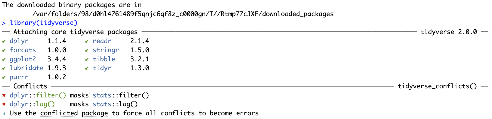
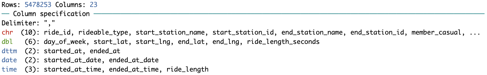
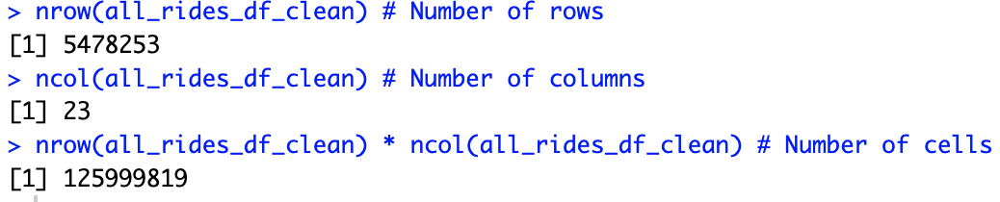
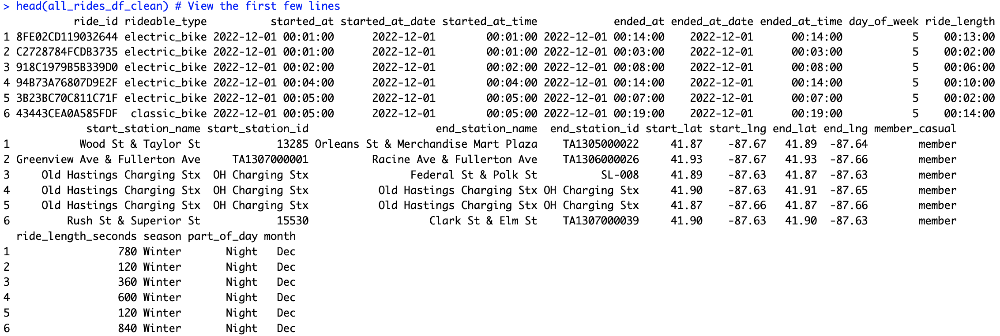
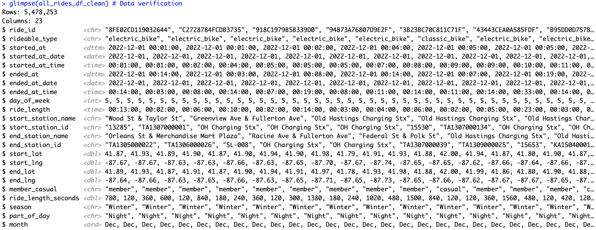
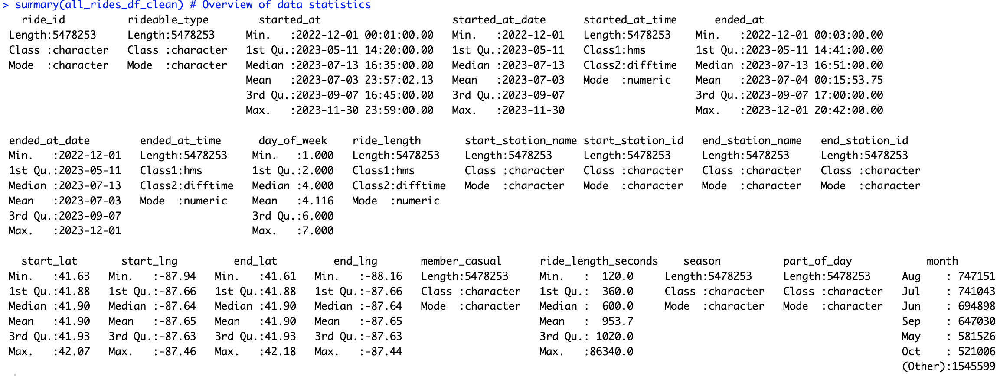
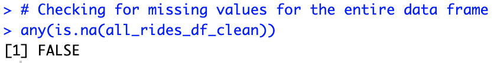
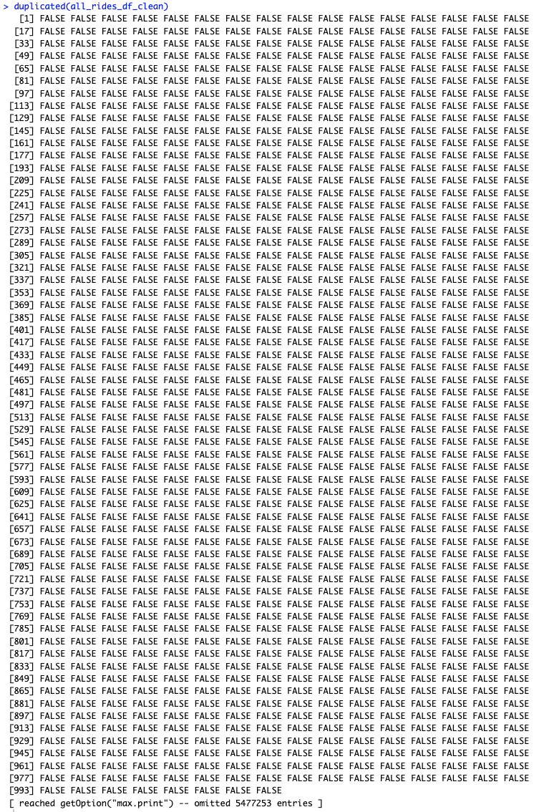

<sub>*Data analysis code and documentation for Cyclistic's bike share data is contained in this repository.
There are several phases to the project, from data analysis to data visualization to recommendations, and this README summarizes each phase.*</sub>

# Data Analytics Capstone Project: Cyclistic Bike Sharing Analysis
**Case Study: How Does a Bike-Share Navigate Speedy Success?** <br>
<sub>*by Vesna M. Brekalo*</sub><br>
<sub>*February, 23 2024*</sub>

## :white_large_square: FOREWORD
I completed a case study on **Cyclistic** bike-share for my Google Data Analytics certification, inspired by my passion for cycling. This project, my first in analytics, explores the differences between casual and member riders following Google's framework: **Ask**, **Prepare**, **Process**, **Analyze**, **Share**, **Act**. Check out [my data visualizations here](https://www.linkedin.com/in/vesna-marija-brekalo).

> **Table of Contents:**
> * **INTRODUCTION** 
>   * Project Overview and Context 
> * **ASK**
>   * Business Goals and Objectives 
>   * Defining the Analytical Task 
>   * Identifying Key Stakeholders 
> * **PREPARE**
>   * Data Sourcing and Initial Exploration 
> * **PROCESS**
>   * Data Cleaning and Preprocessin 
> * **ANALYZE & SHARE**
>   * Ride Volume Analysis 
>   * Average Ride Duration Insights 
>   * Bike Type Preferences 
>   * Temporal Usage Patterns 
>   * Station Popularity Metrics 
> * **ACT**
>   * Strategic Recommendations for Action

## :white_large_square: INTRODUCTION
**Cyclistic**, founded in 2016, operates a vast fleet of over 16,500 bicycles covering 190 square miles in Chicago. The bikes, strategically located across 800 stations in the city, cater to urban riders with diverse heights and abilities, boasting a design focused on comfort and stability. Users can unlock bikes at any station and return them to any other station at their convenience.

Initially, Cyclistic's marketing aimed at raising general awareness and appealing to a diverse audience with various pricing plans: single-ride passes, full-day passes, and annual memberships. Casual riders are those opting for short-term passes, whereas annual memberships are purchased by Cyclistic members.

Financial analysis indicates annual members generate more profit than casual riders. To capitalize on this, Moreno, Cyclistic's director of marketing, prioritizes converting casual riders into members rather than attracting new customers. The strategy revolves around understanding the differences between these groups, why casual riders might switch to memberships, and the role of digital media in marketing.

Maximizing annual memberships is key to Cyclistic's future success, prompting Moreno's team to analyze historical trip data to uncover trends. As their recommendations necessitate executive approval, they must provide compelling data insights and professional visualizations.

## :white_large_square: ASK
**Business Objective:**<br>
Develop effective marketing strategies to convert casual riders into annual members. <br>

To **achieve** this **objective**, the future marketing program will address the following three pivotal **questions**:
> 1. How do annual members and casual riders use Cyclistic bikes differently?
> 2. Why would casual riders buy Cyclistic annual memberships?
> 3. How can Cyclistic leverage digital media to encourage casual riders to transition into annual members?

**Key Stakeholders:**
- Lily Moreno: Director of the marketing team and my supervisor.
- Cyclistic executive team.

## :white_large_square: PREPARE
### Data Collection and Sources:

For this case study, we utilize data from Divvy, a real bike share company operating in Chicago, as a proxy for the fictional company Cyclistic.<br>
These datasets are publicly available through Motivate International Inc. [under a specified license](https://divvybikes.com/data-license-agreement) and can be accessed for [download here](https://divvy-tripdata.s3.amazonaws.com/index.html).<br>
The data is released monthly and is characterized by being anonymized, reliable, original, comprehensive, up-to-date, and properly cited.
<br>
<div>
   
</div>
<br>

In this study, we have analyzed historical travel data from 12 separate CSV files, each corresponding to a month within the period from December 2022 to November 2023. The collective dataset encompasses a total of 5,676,710 recorded trips.<br>

The dataset is structured into 13 distinct columns, or variables, which include:

| No. | Description                            | Column Name      | Type           |
|----:|:----------------------------------------|:------------------|:-------------|
|   1 | Unique identifier for each trip:        | `ride_id`         | String       |
|   2 | Type of bicycle:                        | `rideable_type`   | String       |
|   3 | Start timestamp of the ride:            | `started_at`      | Date & Time  |
|   4 | End timestamp of the ride:              | `ended_at`        | Date & Time  |
|   5 | Name of the starting station:           | `start_station_name` | String    |
|   6 | Identifier for the starting station:    | `start_station_id`   | String    |
|   7 | Name of the ending station:             | `end_station_name`   | String    |
|   8 | Identifier for the ending station:      | `end_station_id`     | String    |
|   9 | The latitude of the starting station:   | `start_lat`          | Numeric   |
|  10 | The longitude of starting station:      | `start_lng`          | Numeric   |
|  11 | The end station's latitude:             | `end_lat`            | Numeric   |
|  12 | The longitude of the end station:       | `end_lng`            | Numeric   |
|  13 | Indicates whether the rider is a casual or a member: | `member_casual` | String   |

While the dataset did not come with an accompanying metadata file, the variables are intuitively named and can be understood without additional context.

The data categorizes riders into two main groups: 
- Casual riders, who typically utilize single rides or day passes 
- Cyclistic members, who are characterized by their annual memberships

This categorization is pivotal for understanding different usage patterns and guiding business strategies.

#### Divvy [Pricing](https://divvybikes.com/pricing) Summary:

<div>
   
</div>
<br>

- **Single Ride**: \$3.30 for up to 30 minutes, with a \$0.15 per minute overage charge.
- **Daily Pass**: \$15 for 24-hour access with unlimited classic bike rides up to 3 hours each; overage cost is \$0.15 per minute for rides over 3 hours.
- **E-Bike Single Ride**: \$3.30 with an additional \$0.20 per minute while in use.
- **Annual Membership**: \$9 monthly for unlimited 45-minute rides; rides exceeding this duration incur a \$0.16 per minute overage fee.
- **Lost/Stolen Bike Fee**: A penalty of \$1200.
- **Cycling for Everyone (C4E)**: A program for eligible residents offering a \$5 annual membership with specific rates and credits for e-bike use.
- **Miscellaneous Fees**: E-bikes can be parked at public racks within the service area for \$1, with a \$25 fine for parking violations or if parked outside the service area.

#### Tools Utilized for Defining Objectives and Analysis:
- Excel: Employed for the initial data cleaning and review process.
- RStudio Desktop: Used for in-depth data analysis and scripting in R.
- Tableau: Leveraged for creating interactive and informative data visualizations.

The analysis commenced with the meticulous cleaning and scrutiny of the dataset in Excel. Subsequently, RStudio Desktop was utilized to conduct detailed data analysis through R scripting. For the visual representation of the insights, Tableau served as the primary tool, enabling the creation of clear and engaging visualizations.

## :white_large_square: PROCESS
The data preparation phase was crucial for ensuring the integrity of the subsequent analysis. This phase involved:

1. **Data Cleaning**: Errors, duplicates, blanks, null values, and outliers were meticulously removed to maintain data quality.

2. **Feature Engineering**: New columns were generated for in-depth temporal analysis. These included `starting_at_date`, `starting_at_time`, `ending_at_date`, and `ending_at_time`, extracted from the `started_at` and `ended_at` timestamps. The `ride_length` was recorded in both minutes and seconds, and `day_of_week` was cataloged to map the ride's start day.

3. **Handling Missing Information**: Blanks in `start_station_name` and `end_station_name` were standardized to 'UNKNOWN START STATION NAME' and 'UNKNOWN END STATION NAME', accounting for **2.425%** of the dataset. 

4. **Standardizing Station Names**: Anomalies such as additional characters in station names were present in **1.7339%** of rows. These were rectified by removing non-essential characters like asterisks and designations (e.g., '(Temp)', 'Test', city or public rack indicators).

5. **Data Validation**: Rides with illogical durations were excluded, along with those under 2 minutes, which constituted **3.5085%** of the total data.

6. **Reconciling Unknown Stations**: The dataset contained **1791716** cells with 'UNKNOWN' station identifiers, equivalent to **2.4275%** of the data. Utilizing latitude and longitude details, a `list_unique_stations.csv` document facilitated the accurate attribution of station names.

The comprehensive analysis revealed that **5.2533%** of the dataset was incomplete, with **3.5113%** necessitating removal to ensure analytical accuracy.

#### Setting up the programming environment

Installing essential packages and libraries for data cleaning and analysis included installing the `tidyverse` package and the `data.table` package, and subsequently, their libraries were also loaded:

| Load Packages         | Description     |
|:-----------------------|:-------------------------------------------------------------------------------------------------------------------|
| `library(tidyverse)`  | A collection of R packages that provide versatile tools for data manipulation, visualization, and analysis.         |
| `library(dplyr)`      | Specialized in data manipulation, providing a set of functions for efficiently modifying and analyzing data frames. |
| `library(tidyr)`      | Focuses on transforming data to a tidy format, making it more suitable for analysis.    |
| `library(readr)`      | Optimized for reading data from various file types, facilitating easy data import.      |
| `library(tibble)`     | Enhances data frames, offering a user-friendly approach to data frame creation and manipulation. |
| `library(lubridate)`  | Simplifies working with dates and times, providing functions that make it easier to parse, manipulate, and do calculations with date-time objects. |
| `library(hms)`        | Designed for easy handling and formatting of time data, complementing the `lubridate` package.  |
| `library(purrr)`      | Enhances functional programming in R, offering tools for iterating over data and simplifying complex operations with lists and vectors. It is particularly useful for executing the same function across multiple elements or datasets and working with list-columns in data frames.  |
| `library(data.table)` | Offers high-performance data manipulation and analysis, suitable for large datasets. Also, it's highly efficient for exporting data frames to various formats. |

### Combined all 12 spreadsheets (months) into a single file, all_rides_df_clean.csv
<div>
   
</div><br>

```
# Load necessary libraries
library(purrr)   # For map_df()
library(readr)   # For read_csv()

# Creating a single dataframe 'all_rides_df_clean.csv' from twelve cleaned CSV files ('YYYY_MM_df_update_clean.csv')

# Merging all cleaned files
# List all files matching the pattern of cleaned CSV files
all_cleaned_files <- list.files(pattern = "^[0-9]{4}_[0-9]{2}_df_update_clean\\.csv$", full.names = TRUE)

# Use map_df to read each file and combine them into one dataframe
all_rides_df_clean <- map_df(all_cleaned_files, read_csv)

# Save the aggregated data to a CSV file without row names
write.csv(all_rides_df_clean, "all_rides_df_clean.csv", row.names = FALSE)

```

<div>
   
</div>
<br>

**An essential step in data analysis is ensuring the data's cleanliness and readiness for further analysis. The following procedures are applied to the `all_rides_df_clean.csv` data frame, each accompanied by a screenshot for visual reference:**

1. **Overview of `all_rides_df_clean.csv`**:
- Obtain an overview of the data frame, including the total number of rows, columns, and cells.
<details>
<div>
   
</div>
</details>

2. **Previewing Data**:
- Use the `head()` function to display the first few rows of the data frame, providing an initial glimpse into the dataset.
<details>
<div>
   
</div>
</details>

3. **Understanding Data Structure**:
- Examine the data structure and its characteristics, including data types of each column.
<details>
<div>
   
</div>
</details>

4. **Identifying Outliers**:
- Apply the `summary()` function to summarize each column, aiding in the identification of unusual or outlier values.
<details>
<div>
   
</div>
</details>

5. **Missing Values in Data Frame**:
- Check the entire data frame for any missing values to ensure data completeness.
<details>
<div>
   
</div>
</details>

6. **Column-wise Missing Values**:
- Investigate missing values by each column to pinpoint areas requiring data imputation or removal.
<details>
<div>
   
</div>
</details>

7. **Duplicate Rows Check**:
- Verify the presence of duplicate rows within the data frame to maintain data integrity.
<details>
<div>
   
</div>
</details>
<br>

*By systematically addressing each of these points, we can assure the data's quality and prepare it for insightful analysis.*

## :white_large_square: ANALYZE & SHARE
**Guiding Questions for Enhanced Data Analysis:**

At this phase of our study, we seek to explore the dynamics of bike usage among Cyclistic's annual members versus casual riders. Our analysis will dissect the following key dimensions to uncover distinct patterns of utilization:

- **Ride Volume**: Assessing the total number of rides undertaken by each group.
- **Average Ride Duration**: Calculating the typical length of rides to identify usage intensity.
- **Bike Type Preferences**: Evaluating the preference for different types of bikes between the two groups.
- **Usage Patterns Over Time**: Analyzing how usage varies across different times of day, days of the week, months, and seasons.
- **Popular Stations**: Identifying the most frequented stations to understand spatial preferences.

Through this detailed analysis, we aim to provide insights into the differing behaviors and preferences between annual members and casual riders, contributing to targeted strategy development for Cyclistic.

### Counts and Percentages of Bike Types Used <br>
```
# Calculate the number of rides by bike type
ride_counts_by_rideable_type <- table(all_rides_df_clean$rideable_type)

# Calculate the total number of rides
total_rides <- sum(ride_counts_by_rideable_type)

# Calculate the percentage share of each bike type
ride_percentages_rideable_type <- (ride_counts_by_rideable_type / total_rides) * 100

# Create a data frame to display the results
rideable_type_usage <- data.frame(
  Rideable_Type = names(ride_counts_by_rideable_type),
  Ride_Count = as.vector(ride_counts_by_rideable_type),
  Percentage = as.vector(ride_percentages_rideable_type)
)

# Display the results
print(rideable_type_usage)
```
|  Bike Type |  Total Rides  | Percentage distribution  |
|:----------------|---------------:|---------------:|
|  classic_bike      | 2605010  | 47.55184 % | 
|   docked_bike      |  79284   | 1.44725 %  |
| electric_bike      |  2793959 | 51.00091 % |  

<div>
   
</div>

The number of rides on electric bikes is the highest among the categories, with electric bikes accounting for 2,793,959 rides. Classic bikes are slightly less popular with 2,605,010 rides, while docked bikes have been used significantly less, with only 79,284 rides. This distribution highlights the growing trend towards electric and classic bikes for urban mobility solutions, possibly due to their convenience, ease of access, and efficiency compared to the more stationary docked bikes.

<div>
   
</div>

Using Cyclistic's historical data on the distribution of bike ride types, the share of electric bikes, classic bikes, and docked bikes is divided into 51.00% for electric bikes, 47.55% for classic bikes, and 1.45% for docked bikes. This data indicates that electric bikes are marginally more popular than classic bikes, with over half of the riders opting for electric bikes.

### Counts and Percentage Distribution of Member and Casual Rides <br>
```
%%R -i all_rides_df_clean

# Count rides for 'Member' and 'Casual' in the 'member_casual' column
count_member_casual <- table(all_rides_df_clean$member_casual)

# Display counts of 'Member' and 'Casual'
print("Counts of Member and Casual Rides:")
print(count_member_casual)

# Calculate the percentages for 'Member' and 'Casual'
percentage_member_casual <- prop.table(count_member_casual) * 100

# Display percentages of 'Member' and 'Casual'
print("Percentage of Member and Casual Rides:")
print(percentage_member_casual)
```
| Biker Status | Total Rides  |  Percentage distribution  |
|:---------------|--------------:|--------------:|
| member    |  3494248   |  63.78398  |    
| casual    |  1984005   |  36.21602  | 

<div>
   
</div>

The dataset reveals a significant distinction in usage patterns between annual members and occasional riders within the Cyclistic bike share system.
Members make up the majority of bike rides according to the dataset, with approximately 3,494,248 rides taken by annual members, compared to casual riders who have taken nearly 1,984,005 rides. This suggests that annual members tend to cycle more frequently than casual riders.

<div>
   
</div>

Cyclistic's historical data reveals a clear pattern in rider types' usage. Annual members account for the majority of rides at 63.78%, equating to 3,494,248 rides. Casual riders, on the other hand, represent 36.22% of rides, totaling 1,984,005. This data indicates a strong preference for membership-based usage within the Cyclistic bike-sharing community.

### Count of Bike Types Usage by Members and Casual Riders <br>
```
# Analyze the use of bike types between members and casual users
usage_by_type_member <- table(all_rides_df_clean$rideable_type[all_rides_df_clean$member_casual == "member"])
usage_by_type_casual <- table(all_rides_df_clean$rideable_type[all_rides_df_clean$member_casual == "casual"])

# Display usage of rideable type by Members
cat("Rideable type usage by Members:\n")
print(usage_by_type_member)

# Display usage of rideable type by Casual riders
cat("Rideable type usage by Casual riders:\n")
print(usage_by_type_casual)
```
|  Bike Type |  Usage by CASUAL riders  | Usage by MAMBER riders  |
|:----------------|---------------:|---------------:|
|  classic_bike      | 852217   | 1752793 |
|   docked_bike      |  79284   | 0 |
| electric_bike      |  1052504 | 1741455 | 

<div>
   
</div>

The graph shows that Cyclistic members predominantly use classic bikes (1,752,793 rides) and electric bikes (1,741,455 rides). Casual riders prefer electric bikes (1,052,504 rides) over classic bikes (852,217 rides) and docked bikes (79,284 rides). Docked bikes are the least utilized type, and their use is exclusive to casual riders within this dataset. Members do not use docked bikes at all. <br>
```
# Determine the most commonly used type of bike
most_common_ride_type <- names(sort(table(all_rides_df_clean$rideable_type), decreasing = TRUE)[1])

# Display the most popular ride type
cat("The most popular ride type is:", most_common_ride_type, "\n")
```
<div>
   
</div>
The **unique** rideable types include electric bikes, classic bikes, docked bikes, and **electric bikes** are the most **popular**.

### Average Ride Length by Users <br>
```
# Required library for time conversion
library(lubridate)

# Direct calculation and formatting of the overall average ride length
mean_ride_length_seconds <- mean(all_rides_df_clean$ride_length_seconds, na.rm = TRUE)
mean_ride_length_hms <- seconds_to_period(mean_ride_length_seconds)
mean_ride_length_formatted <- sprintf("%02d:%02d:%02d", 
                                      hour(mean_ride_length_hms), 
                                      minute(mean_ride_length_hms), 
                                      second(mean_ride_length_hms)
                                     )

# Display the overall average ride length
cat("The overall average length of rides:", mean_ride_length_formatted, "\n")

# Calculation of the average ride length in seconds for members and casual users
average_ride_length_member_seconds <- mean(
    all_rides_df_clean$ride_length_seconds[all_rides_df_clean$member_casual == "member"], na.rm = TRUE)
average_ride_length_casual_seconds <- mean(
    all_rides_df_clean$ride_length_seconds[all_rides_df_clean$member_casual == "casual"], na.rm = TRUE)

# Convert the averages to HH:MM:SS format
average_ride_length_member_hms <- seconds_to_period(average_ride_length_member_seconds)
average_ride_length_member_formatted <- sprintf("%02d:%02d:%02d", 
                                                hour(average_ride_length_member_hms), 
                                                minute(average_ride_length_member_hms), 
                                                second(average_ride_length_member_hms)
                                               )

average_ride_length_casual_hms <- seconds_to_period(average_ride_length_casual_seconds)
average_ride_length_casual_formatted <- sprintf("%02d:%02d:%02d", 
                                                hour(average_ride_length_casual_hms), 
                                                minute(average_ride_length_casual_hms), 
                                                second(average_ride_length_casual_hms)
                                               )

# Display the formatted average ride lengths for member and casual riders
cat("The average ride length for member riders:", average_ride_length_member_formatted, "\n")
cat("The average ride length for casual riders:", average_ride_length_casual_formatted, "\n")
```


## :white_large_square: ACT

#### It is not yet finished, the rest will be added soon :)
